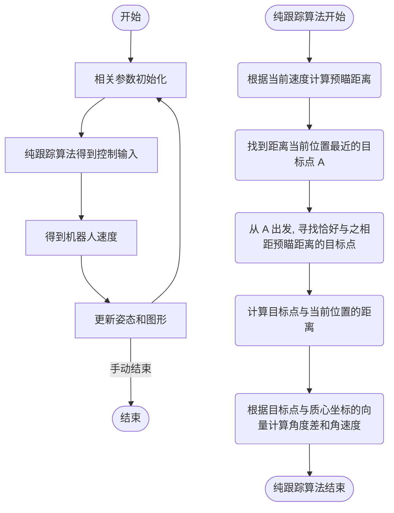
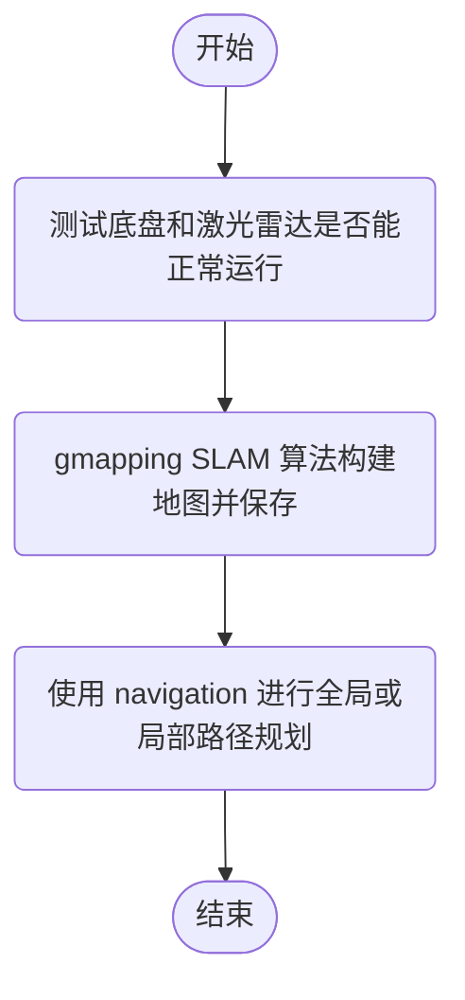

```mermaid
graph TD
0([开始])
A[相关参数初始化]-->AA[纯跟踪算法得到控制输入]-->AAA[得到机器人速度]-->AAAA[更新姿态和图形]-->A
AAAA--手动结束-->1([结束])

%% 纯跟踪算法
00([纯跟踪算法开始])
B(根据当前速度计算预瞄距离)
C(找到距离当前位置最近的目标点 A)
0-->A
00-->B
B-->C
D(从 A 出发, 寻找恰好与之相距预瞄距离的目标点)
C-->D
D-->E
E-->F
E(计算目标点与当前位置的距离)
F(根据目标点与质心坐标的向量计算角度差和角速度)
F-->11
11([纯跟踪算法结束])
```

```mermaid
graph TD
00([开始])
B(测试底盘和激光雷达是否能正常运行)
C(gmapping SLAM 算法构建地图并保存)
00-->B
B-->C
D(使用 navigation 进行全局或局部路径规划)
C-->D
D-->11
11([结束])
```

